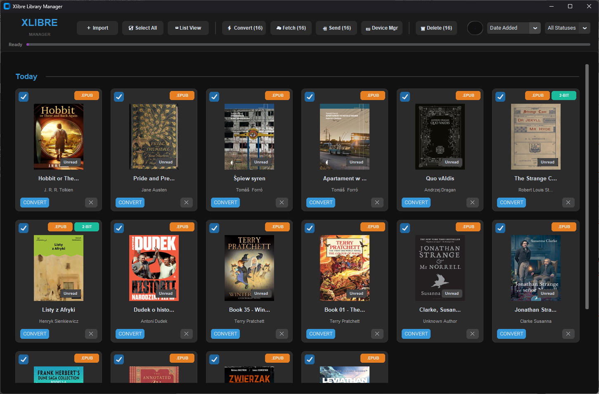
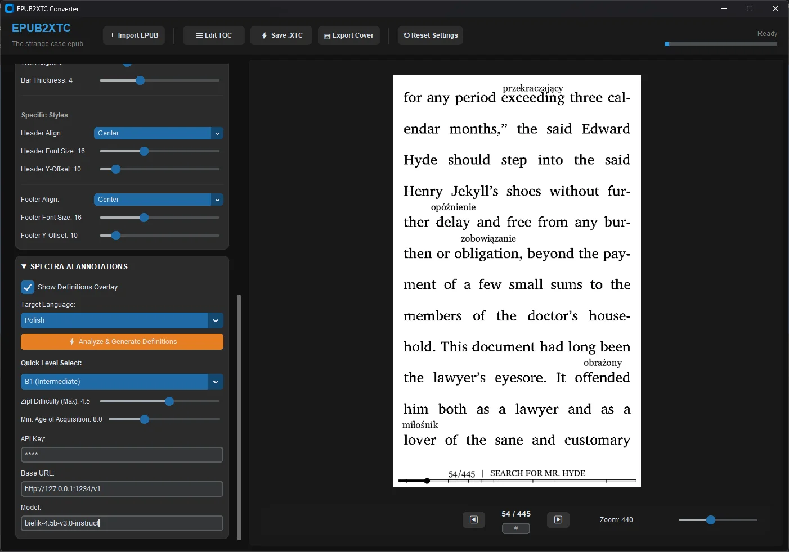

# Xalibre Library Manager & Converter

**Xalibre** is a comprehensive e-book management tool designed to organize your EPUB library, fetch metadata, edit book details, and convert files into the optimized **XTC** format for e-ink devices (specifically the Xteink X4).

> **Note:** This application was formerly known as **Epub2XTC** before evolving into the full-featured Xalibre Library Manager.

---

## ✨ Features

* **📚 Library Management**: Organize, sort, and filter your e-book collection with a local SQLite database.
* **⚡ EPUB to XTC Conversion**: Convert standard books into **1-bit** or **2-bit** bitmaps optimized for high-performance e-ink rendering.
* **🧠 Spectra AI**: A "Word Wise"-like language learning engine that uses AI to analyze text difficulty and generate inline synonyms/translations above complex words.
* **📝 Inline Footnotes**: Automatically extracts footnotes (which usually require jumping to the end of the book) and inserts them directly into the text inside a box immediately after the paragraph where they are referenced.
* **☁️ Metadata Fetching**: Automatically scrape book details and high-quality covers from Google Books, Apple Books, and Open Library.
* **🖱️ Smart Drag & Drop**: Import books by dropping them in, and export specific formats (Cover, EPUB, or XTC) by dragging cards out.
* **📡 Wireless Device Manager**: Browse files on your Xteink X4 and transfer books wirelessly via Wi-Fi.
---

---

## 🚀 Getting Started

### Installation
* **Run**: Execute the `Xalibre-main.py` script or launch the compiled executable.
* **First Run**: The application automatically creates necessary directories:
    * **Windows Config**: `%APPDATA%\Xalibre`
    * **Mac/Linux Config**: `~/.config/Xalibre`
    * **Library Data**: Creates `Library`, `Exports`, `Presets`, and `Fonts` folders in your base directory (default `~/Xalibre`).

---

## 📚 Library Manager

The main interface is your central hub for organizing, viewing, and deploying your books.

### 1. Organizing & Browsing
* **Importing**: Drag `.epub` files directly onto the window (background turns green) or click **`＋ Import`**.
* **Searching**: Filter by Title or Author in real-time using the top-right search bar.
* **Views**: Toggle between **Grid View** (Cover cards) and **List View** (Compact rows).
* **Deleting**: Click the **`🗑`** icon on a card. You can also delete specific file formats (e.g., just the converted XTC file) by clicking the **`✕`** on the file badge.

### 2. Built-in Viewers
Accessed by clicking a book's cover or right-clicking to open **Book Details**:
* **`📖 View Epub`**: Renders HTML structure to verify source content and chapters.
* **`🖼 View XTC`**: Pixel-perfect preview of the binary XTC file. This allows you to check dithering quality and layout without the hardware device.
* *Note: There is no raw hex viewer.*

### 3. Device Manager (Sending Books)
Xalibre includes a dedicated manager for the Xteink X4:
* **Manual Manager**: Click **`📟 Device Mgr`** to connect to the device IP. You can browse folders and **drag & drop** files into the list to upload.
* **Quick Send**: Select books in the library and click **`📲 Send`**.
    * **Wi-Fi**: Supports Custom IP, X4 Hotspot (`192.168.3.3`), and CrossPoint profiles.
    * **USB**: Export to a local folder (optionally creating a `/Covers` directory for lock screens).

### 4. Smart Export (Granular Drag & Drop)
You can export files by dragging items *from* the library card to your computer:
* **Cover Only**: Drag the **Cover Image** (.BMP).
* **Original**: Drag the orange **.EPUB badge**.
* **Converted**: Drag the green/teal **.XTC badge**.
* **Full Package**: Drag the **background** of the card to export a folder containing all files.

### 5. Metadata Editor
* **Fetch Cloud Data**: Select books and click **`☁ Fetch`** to scrape descriptions and covers.
* **Manual Edit**: Right-click a book -> **`✎ Edit Manually`** to change text or upload custom covers.

---

## ⚡ Converter Engine (EPUB to XTC)

Select a book and click **`⚡ Convert`** to open the Editor. This prepares the file for the e-ink screen.

### 1. Render Engine
* **Target Format**: 
    * `1-bit (XTG)`: Pure Black & White (Best for text clarity).
    * `2-bit (XTH)`: 4-Level Grayscale (Best for Manga/Images).
* **Mode**: 
    * `Threshold`: High contrast for text.
    * `Dither`: Dot patterns for shading images.

### 2. Typography & Layout
* **Fonts**: Choose system fonts or import custom ones.
* **Inline Footnotes**: Enable this to extract standard endnotes and insert them into a box directly below the paragraph where they are referenced.
* **Sizing**: Adjust Font Size (default 28pt), Weight, and Line Height.
* **Custom Fonts**: Click **`Aa Import Font`** in the converter toolbar to add `.ttf` or `.otf` files to your library.

### 3. Spectra AI
* **Functionality**: Acts like "Word Wise", providing inline glossaries for difficult terms.
* **Configuration**:
    * **API**: Requires OpenAI API Key.
    * **Target Language**: Select language for definitions or translations.
    * **Difficulty**: Set threshold based on Zipf frequency & Age of Acquisition (AoA) to determine which words get annotated.

### 4. Presets
* Save your complex settings (e.g., "Night Mode", "Manga", "Language Learning") as reusable **Presets** using the `💾` icon.

---

## ⚙️ Settings

**Access**: Click the large **"Xalibre MANAGER"** logo text in the top-left of the toolbar.

* **Library Location**: Change the physical path of your library folder.
* **Device IP**: Set the default IP address for the X4 Reader.
* **Defaults**: Configure startup preferences (Grid/List view, Sort order).
