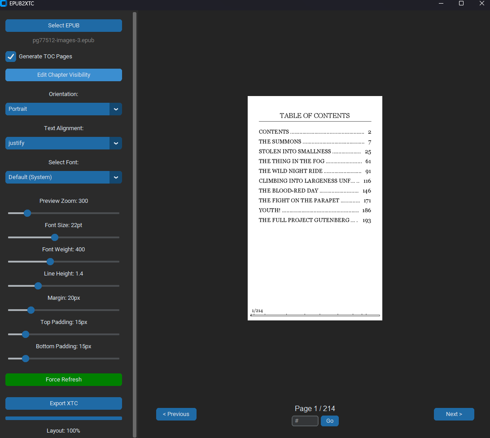
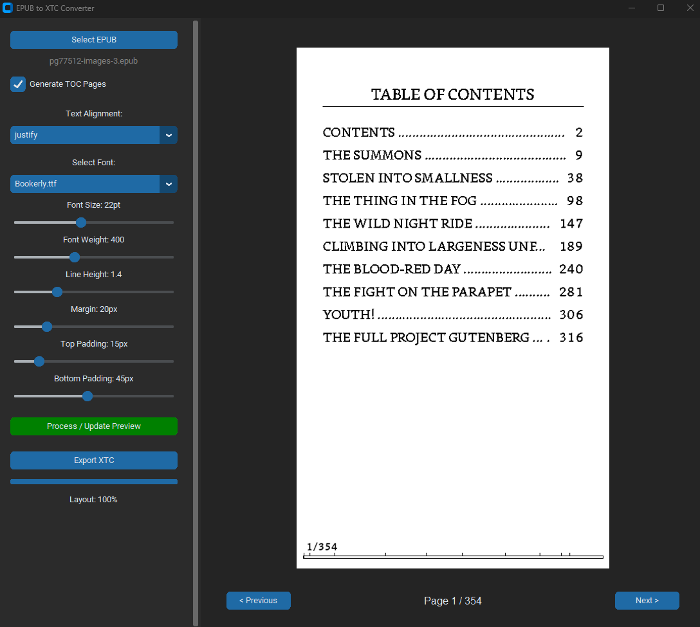

# EPUB to XTC Converter for Xteink X4
Epub to XTC converter

A GUI-based tool designed to convert standard `.epub` files into the `.xtc` binary format required by the **Xteink X4** e-reader. It renders HTML content into paginated, bitmapped images optimized for e-ink displays.

[](https://epub2xtc.streamlit.app/)

## Main Features

* **Smart Hyphenation:** Uses `pyphen` to inject soft hyphens into text nodes, ensuring proper line breaks and justified text flow.
* **Table of Contents Generation:** Automatically creates visual TOC pages at the start of the file, linked to specific rendered page numbers.
* **Visual Progress Bar:** Generates a reading progress bar at the bottom of every page, including indicators for chapter start points.
* **Custom Typography:** Supports system fonts and external `.ttf` / `.otf` fonts. Allows adjustment of font weight, size, and line height.
* **Image Optimization:** Automatically extracts, scales, contrast-enhances, and dithers (Floyd-Steinberg) images embedded in the EPUB.
* **Layout Control:** Configurable margins, top/bottom padding, and text alignment (Justified/Left).





## 📥 Installation

### Option 1: Run from Source
1. **Install the dependencies:**
    ```bash
    pip install pymupdf Pillow EbookLib beautifulsoup4 pyphen customtkinter
    ```
2.  **Clone the repository:**
    ```bash
    git clone https://github.com/Rafal-P-Mazur/EPUB2XTC.git
    cd EPUB2XTC
    ```
3.  **Run the App:**
    ```bash
    python EPUB2XTC.py
    ```

### Option 2: Standalone Executable (.exe)
If you have downloaded the [Release version](https://github.com/Rafal-P-Mazur/EPUB2XTC/releases), simply unzip the file and run `EPUB2XTC.exe`. No Python installation is required.

## 📖 User Manual

1.  **Load an EPUB:** Click **Select EPUB** in the sidebar to choose your input file.
2.  **Configure Layout:**
    * **Font:** Choose from the detected system/local fonts.
    * **Sliders:** Adjust Font Size, Weight, Line Height, Margins, and Padding.
    * **TOC:** Check "Generate TOC Pages" to include a navigation section at the beginning.
3.  **Process:** Click the **Process / Update Preview** button. The application will:
    * Parse the EPUB.
    * Apply hyphenation and CSS.
    * Render pages to memory.
    * Update the preview pane.
4.  **Preview:** Use the **< Previous** and **Next >** buttons to verify the rendering.
5.  **Export:** Click **Export XTC** to save the final file.
## 📦 Dependencies

* `customtkinter` (GUI)
* `PyMuPDF` (Rendering)
* `Pillow` (Image Processing)
* `EbookLib` & `BeautifulSoup4` (Parsing)
* `Pyphen` (Hyphenation)

---

## 📄 License
MIT License

